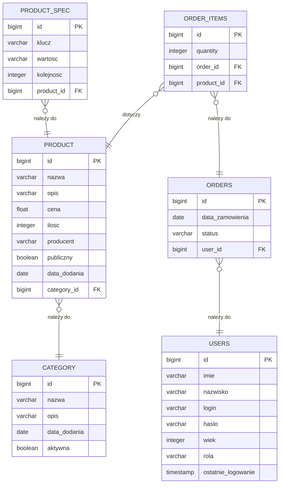

# Diagram bazy danych

```mermaid
erDiagram
    USERS {
        bigint id PK
        varchar imie
        varchar nazwisko
        varchar login
        varchar haslo
        integer wiek
        varchar rola
        timestamp ostatnie_logowanie
    }

    CATEGORY {
        bigint id PK
        varchar nazwa
        varchar opis
        date data_dodania
        boolean aktywna
    }

    PRODUCT {
        bigint id PK
        varchar nazwa
        varchar opis
        float cena
        integer ilosc
        varchar producent
        boolean publiczny
        date data_dodania
        bigint category_id FK
    }

    PRODUCT_SPEC {
        bigint id PK
        varchar klucz
        varchar wartosc
        integer kolejnosc
        bigint product_id FK
    }

    ORDERS {
        bigint id PK
        date data_zamowienia
        varchar status
        bigint user_id FK
    }

    ORDER_ITEMS {
        bigint id PK
        integer quantity
        bigint order_id FK
        bigint product_id FK
    }

    PRODUCT }o--|| CATEGORY : "nalezy do"
    PRODUCT_SPEC }o--|| PRODUCT : "nalezy do"
    ORDERS }o--|| USERS : "nalezy do"
    ORDER_ITEMS }o--|| ORDERS : "nalezy do"
    ORDER_ITEMS }o--|| PRODUCT : "dotyczy"
```
